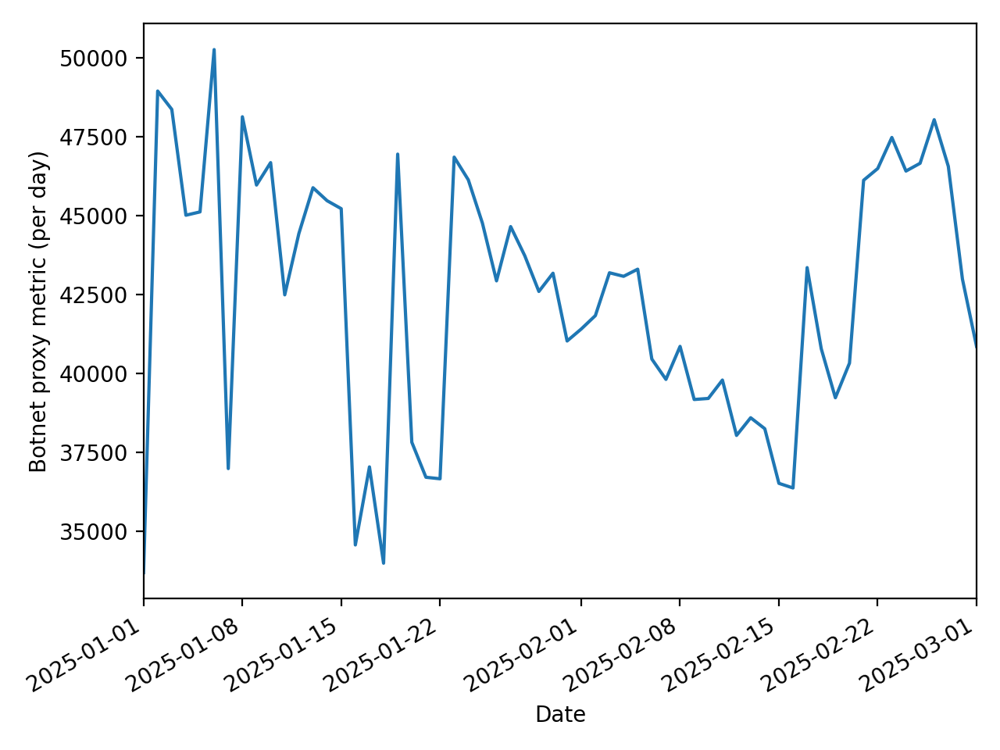

# DarkHarvest

DarkHarvest builds a combined **cloud outage timetable** (AWS, Google Cloud, Cloudflare) and overlays it with a **botnet activity proxy** time series derived from **SANS ISC / DShield port history** (for selected ports such as 23/2323/7547/5555). The output is:

- `outages.csv` — normalized incident table (provider, time window, severity, URL)
- `overlay.png` — a time series plot with outage windows shaded

> Note: the “botnet series” here is a **proxy signal** (e.g., daily `sources` counts on ports commonly associated with IoT scanning), not a direct count of compromised devices.

---

## Example output

Below is an example of the overlay graph.



---

## Requirements

- Python (3.10+ recommended)
- [`uv`](https://github.com/astral-sh/uv) for environment + dependency management

---

## Setup

Install dependencies:

```bash
make sync
```

---

## Usage

### Run the default pipeline

This fetches incidents and builds the overlay plot for the configured date range and ports:

```bash
make main
```

This runs:

* AWS status RSS parsing
* Google Cloud incidents JSON
* Cloudflare incidents JSON
* DShield port history API for the ports you provide (metric selectable)
* Aggregation and plotting

Outputs (by default):

* `outages.csv`
* `overlay.png`

---

## Debug mode

To enable verbose debug logging (including request/response metadata and dataframe samples):

```bash
make debug
```

---

## Useful time windows

```bash
make 3month
make last-month
```

---

## Linting / Formatting

```bash
make lint
```

This runs:

* `ruff format .`
* `ruff check . --fix`

---

## CLI options (what the Makefile uses)

The Makefile calls `python -m src.cli` with options like:

* `--start YYYY-MM-DD` / `--end YYYY-MM-DD`
  Date range for outage ingestion and DShield time series.
* `--ports <int> <int> ...`
  Ports used for the botnet proxy signal (examples: `23 2323 7547 5555`).
* `--botnet-metric <metric>`
  DShield port history metric (commonly `sources`, also often `targets` or `records` depending on analysis).
* `--user-agent "<string>"`
  Custom User-Agent for DShield requests.
* `--out-csv <path>`
  Output CSV filename for incidents.
* `--out-plot <path>`
  Output plot filename.
* `--debug`
  Enables debug logging.

---

## Expected behavior

1. **Fetch outage data**

   * AWS: RSS feed
   * GCP: incidents JSON
   * Cloudflare: incidents JSON
2. **Normalize and write outages**

   * Produces a single unified `outages.csv`
3. **Fetch botnet proxy series**

   * Queries DShield port history for each port and aggregates into a daily series
4. **Plot overlay**

   * Plots botnet proxy as a line
   * Shades outage windows by provider

If the botnet proxy series is empty:

* The plot will still be produced, but the series may be flat/empty depending on your implementation.
* Run `make debug` and inspect DShield parsing logs.

---

## Data sources

* AWS Service Health (RSS): `https://status.aws.amazon.com/rss/all.rss`
* Google Cloud incidents: `https://status.cloud.google.com/incidents.json`
* Cloudflare incidents: `https://www.cloudflarestatus.com/api/v2/incidents.json`
* SANS ISC / DShield port history: `https://isc.sans.edu/api/`

